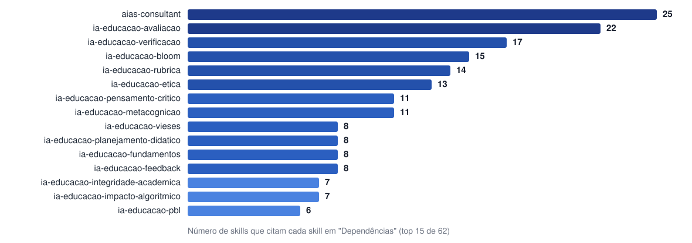
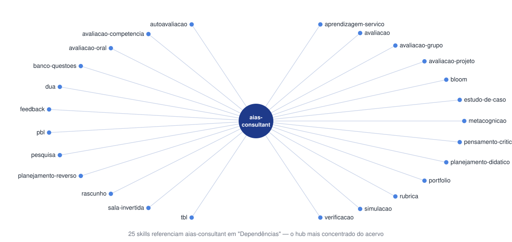
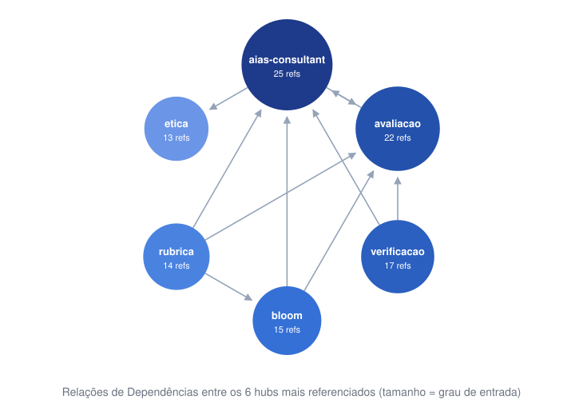

<!-- _class: lead -->
<!-- _paginate: false -->

# Skills de IA na Educação
## Acervo de skills para CLIs de IA

Integração responsável de IA na Educação
Alinhado ao Referencial do MEC (2026)

**62 skills** organizadas em **5 categorias**

---

# Visão Geral

Repositório de skills para CLIs de IA (`skills/*/SKILL.md`) para apoiar educadores, gestores e instituições na adoção responsável de IA.

| Categoria | Nº de skills |
|:----------|:---:|
| `niveis-ensino` | 5 |
| `formacao-docente` | 18 |
| `etica-governanca` | 8 |
| `inclusao-equidade` | 5 |
| `ferramentas-praticas` | 26 |

Cada skill: frontmatter YAML + Princípios, Workflow, Formato de Saída, Exemplos, Limitações, Dependências, Referências (ABNT).

---

<!-- _class: lead -->

# 1. Níveis de Ensino
`niveis-ensino`

Orientação específica por etapa educacional

---

# Níveis de Ensino (1/2)

- **infantil** — restrições e cuidados da IA na Educação Infantil, conforme Referencial MEC
- **basica** — integração gradual e segura na Educação Básica: aprender *sobre* IA antes de depender *de* IA
- **ensino-medio** — letramento em IA, impactos sociais/éticos/econômicos + exploração prática

---

# Níveis de Ensino (2/2)

- **profissional-tecnologica** — IA na EPT, competências digitais alinhadas às demandas do mundo do trabalho
- **superior** — IA na Educação Superior e Pós-Graduação: ensino, pesquisa, extensão e gestão acadêmica

---

<!-- _class: lead -->

# 2. Formação Docente
`formacao-docente`

Metodologias ativas e desenvolvimento pedagógico

---

# Formação Docente (1/4)

- **fundamentos** — conceitos básicos de IA para educadores (Referencial MEC 2026)
- **formacao-inicial-docente** — IA nas licenciaturas, formação de futuros professores
- **planejamento-didatico** — IA como assistente de planejamento de aulas e materiais
- **planejamento-reverso** — Backward Design (Wiggins & McTighe) para disciplinas com IA
- **bloom** — Taxonomia Revisada de Bloom + extensão digital (Churches) com IA

---

# Formação Docente (2/4)

- **aprendizagem-ativa** — IA integrada a PBL, investigação orientada, gamificação
- **pensamento-critico** — IA como estímulo (não substituta) do pensamento crítico
- **metacognicao** — aprendizagem autorregulada e consciência do próprio raciocínio
- **pbl** — Aprendizagem Baseada em Problemas/Projetos com IA
- **sala-invertida** — Flipped Classroom: design do pré-aula assíncrono com IA

---

# Formação Docente (3/4)

- **simulacao** — role-playing e simulações de cenários profissionais complexos
- **estudo-de-caso** — casos mal-estruturados e método Harvard com IA
- **peer-instruction** — método Mazur: ConcepTests e discussão entre pares
- **tbl** — Team-Based Learning: Readiness Assurance Process (iRAT/gRAT)
- **aprendizagem-servico** — Aprendizagem-Serviço e Extensão Universitária

---

# Formação Docente (4/4)

- **debate** — debate estruturado e argumentação acadêmica (Oxford, Fishbowl, Socrático)
- **facilitacao** — facilitação de discussões colaborativas com IA de apoio
- **interdisciplinaridade** — atividades interdisciplinares em cursos STHEM

---

<!-- _class: lead -->

# 3. Ética e Governança
`etica-governanca`

Fundamentos éticos, riscos e conformidade normativa

---

# Ética e Governança (1/3)

- **etica** — fundamentos ético-pedagógicos, alinhados a UNESCO/OCDE/UE
- **governanca-dados** — políticas de dados conforme LGPD e ECA Digital
- **supervisao-humana** — níveis de autonomia da IA e supervisão humana
- **transparencia-explicabilidade** — requisitos de transparência de sistemas de IA

---

# Ética e Governança (2/3)

- **vieses** — identificação, prevenção e mitigação de vieses algorítmicos
- **impacto-algoritmico** — Avaliações de Impacto Algorítmico (AIA) em educação
- **seguranca-digital** — proteção de dados e bem-estar (LGPD, ECA Digital)

---

# Ética e Governança (3/3)

- **integridade-academica** — diretrizes de uso ético de IA em trabalhos acadêmicos

---

<!-- _class: lead -->

# 4. Inclusão e Equidade
`inclusao-equidade`

Acesso, acessibilidade e permanência

---

# Inclusão e Equidade

- **acessibilidade-inclusao** — IA para ampliar acessibilidade (LBI + DUA)
- **dua** — Desenho Universal para a Aprendizagem, todos os níveis
- **equidade-digital** — políticas contra desigualdades digitais no acesso à IA
- **letramento-dados** — alfabetização em dados para educadores e estudantes
- **permanencia** — IA para prevenção de evasão e abandono escolar

---

<!-- _class: lead -->

# 5. Ferramentas Práticas
`ferramentas-praticas`

Avaliação, produção de conteúdo e operação

---

# Ferramentas Práticas — Avaliação (1/2)

- **avaliacao** — redesenho de instrumentos avaliativos com IA generativa
- **avaliacao-competencia** — rubricas de proficiência e certificação de competências
- **avaliacao-diagnostica** — mapeamento de pré-requisitos e misconceptions
- **avaliacao-grupo** — peer assessment e contribuição individual em equipes
- **avaliacao-oral** — apresentações, defesas de TCC, exames orais
- **avaliacao-projeto** — projetos interdisciplinares, PBL/PjBL, iniciação científica

---

# Ferramentas Práticas — Avaliação (2/2)

- **autoavaliacao** — escalas, rubricas e diários reflexivos
- **rubrica** — rubricas analíticas/holísticas alinhadas a Bloom, AIAS e DUA
- **banco-questoes** — blueprints de prova e bancos de itens
- **mcq** — questões de múltipla escolha para disciplinas STHEM
- **portfolio** — portfólios avaliativos de disciplina e desenvolvimento profissional
- **aias-consultant** — consultoria sobre a Escala AIAS (`/aias-consultant`)

---

# Ferramentas Práticas — Produção e Apoio (1/2)

- **feedback** — feedback formativo específico e acionável com IA
- **escrita** — escrita acadêmica preservando voz autoral do estudante
- **pesquisa** — pesquisa acadêmica: problema, revisão sistemática, metodologia
- **visualizacao-dados** — storytelling com dados em contextos STHEM
- **design-problema** — problemas e situações-gatilho autênticos
- **personalizacao** — sistemas de personalização do ensino mediados por IA

---

# Ferramentas Práticas — Produção e Apoio (2/2)

- **rascunho** — Chain of Draft: raciocínio conciso e denso
- **verificacao** — Chain of Verification: validação de materiais gerados por IA
- **sti** — Sistemas Tutoriais Inteligentes em sala de aula
- **ia-desplugada** — atividades sem dispositivos digitais

---

# Ferramentas Práticas — Gestão e Política

- **gestao** — competências de gestores para adoção responsável de IA
- **contratacao** — critérios técnicos/pedagógicos/éticos para contratar plataformas
- **sandbox** — sandboxes regulatórios para testagem segura de sistemas de IA
- **ecossistema-inovacao** — pesquisa, desenvolvimento e soberania tecnológica nacional

---

# A Escala AIAS

5 níveis não-hierárquicos e cumulativos de uso de IA em avaliações (Perkins, Furze, Roe & MacVaugh, 2024–2025):

| Nível | Nome | IA permitida |
|:-:|:--|:--|
| 1 | Sem IA | Nenhuma |
| 2 | Planejamento Assistido por IA | Ideação e estruturação |
| 3 | Colaboração com IA | Elaboração e refinamento |
| 4 | IA Integral | Uso estratégico e abrangente |
| 5 | Exploração de IA | Co-criação e inovação |

Detalhada pela skill **aias-consultant** e usada como referência transversal em `rubrica`, `avaliacao` e demais skills de avaliação.

---

# Como usar

```bash
# Instalar uma skill específica
npx skills add ./skills/ia-educacao-avaliacao

# Instalar todas as skills
for d in skills/*/; do npx skills add "./$d"; done
```

Cada skill é invocada com `/ia-educacao-<sufixo>`
Exceção: `/aias-consultant` (sem prefixo)

Listar skills instaladas: `/skills`

---

<!-- _class: lead -->

# Obrigado

Repositório: `skills-ia-educacao`
Referencial MEC para IA na Educação (2026)

---

<!-- _class: lead -->
<!-- _paginate: false -->

# Anexo
## Grafo de dependências entre skills

Concentração (hubs) a partir da seção `## Dependências` de cada `SKILL.md`

---

# Skills mais referenciadas (hubs)



---

# O maior hub: `aias-consultant`



---

# Relação entre os principais hubs


